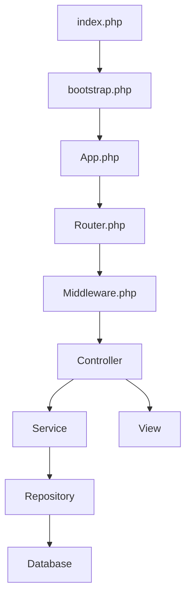

# Architecture et Dépendances MaxitSA

## 1. Points d'entrée
```
public/index.php
  └── app/config/bootstrap.php
      └── App::init()
```

## 2. Core Framework (Premier niveau)
```
app/Core/
├── App.php                  # Container IoC - Chargé en premier
├── Database.php            # Connexion BD - Dépend de App
├── Session.php             # Gestion sessions - Dépend de App
├── Router.php             # Routage - Dépend de App & Middleware
├── Middleware.php         # Sécurité - Dépend de Session
└── Validator.php         # Validation - Standalone
```

## 3. Entités (Second niveau)
```
src/Entite/
├── Utilisateur.php       # Entité de base
├── Compte.php           # Dépend de Utilisateur
├── Transaction.php      # Dépend de Compte
├── TypeCompte.php       # Utilisé par Compte
└── TypeTransaction.php  # Utilisé par Transaction
```

## 4. Repositories (Troisième niveau)
```
src/Repository/
├── UserRepository.php         # Dépend de Database & Utilisateur
├── CompteRepository.php       # Dépend de Database & Compte
└── TransactionRepository.php  # Dépend de Database & Transaction
```

## 5. Services (Quatrième niveau)
```
src/Service/
├── UserService.php          # Dépend de UserRepository
├── ValidationService.php    # Dépend de Validator
├── FileUploadService.php    # Standalone
└── SmsService.php          # Standalone
```

## 6. Controllers (Cinquième niveau)
```
src/Controller/
├── AbstractController.php           # Base Controller
├── SecurityController.php           # Dépend de UserService
├── UserController.php              # Dépend de UserService & CompteRepository
└── ServiceCommercialController.php  # Dépend de tous les repositories
```

## 7. Vues (Sixième niveau)
```
templates/
├── layouts/
│   ├── base.login.html.layout.php
│   ├── base.service.html.layout.php
│   └── base.solde.html.layout.php
└── views/
    ├── login.html.php              # Utilisé par SecurityController
    ├── accueil.html.php           # Utilisé par UserController
    └── service-commercial/
        └── dashboard.html.php      # Utilisé par ServiceCommercialController
```

## Flux de données


## Ordre de création des fichiers

1. **Configuration initiale**
   - composer.json
   - .env
   - public/index.php
   - app/config/bootstrap.php

2. **Core Framework**
   - App.php (Container IoC)
   - Database.php
   - Session.php
   - Validator.php
   - Router.php
   - Middleware.php

3. **Modèles de données**
   - Entités
   - Repositories
   - Services

4. **Logique métier**
   - Controllers
   - Middleware spécifiques
   - Services métier

5. **Interface utilisateur**
   - Layouts
   - Vues
   - Assets (CSS/JS)

## Dépendances clés

- **Controllers** dépendent de:
  - Services
  - Repositories
  - Session
  - Validator

- **Services** dépendent de:
  - Repositories
  - FileUpload
  - Validator

- **Repositories** dépendent de:
  - Database
  - Entités

- **Router** dépend de:
  - Controllers
  - Middleware

## Initialisation de l'application

1. `public/index.php` charge l'autoloader
2. `bootstrap.php` initialise l'environnement
3. `App::init()` charge les services
4. `Router` analyse l'URL
5. `Middleware` vérifie les autorisations
6. `Controller` traite la requête
7. `Service` applique la logique métier
8. `Repository` accède aux bases données
9. `View` affiche le résultat